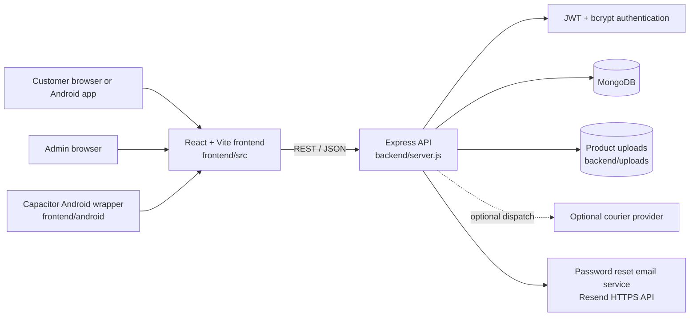
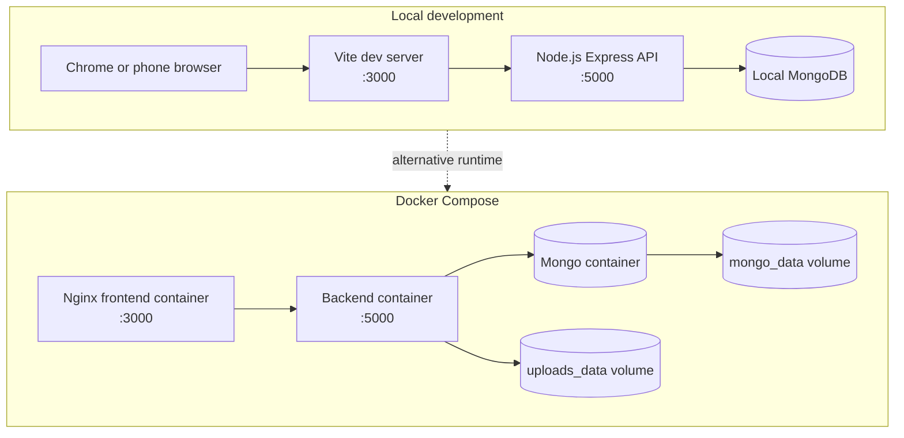
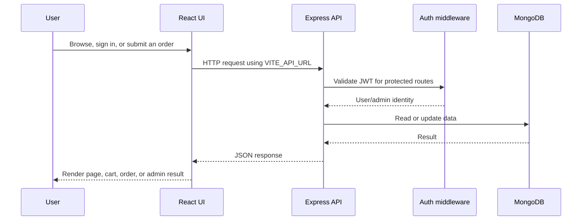
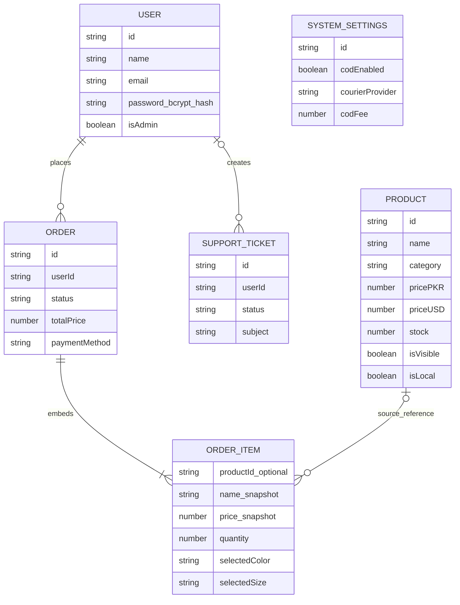

# IndusCart Architecture

This document describes the current IndusCart system as implemented in this repository.

## System overview

## Local and Docker deployment

## Browser request flow

## Main backend modules

| Area | Entry points | Responsibility |
|---|---|---|
| Authentication | `routes/authRoutes.js`, `controllers/authController.js` | Registration, login, session verification, own-password change, one-time customer reset links |
| Products | `routes/productRoutes.js`, `controllers/productController.js` | Catalog, visibility, categories, variants, images, stock |
| Orders | `routes/orderRoutes.js`, `controllers/orderController.js` | Checkout validation, order creation, status updates, analytics |
| Support | `routes/supportRoutes.js`, `controllers/supportController.js` | Customer support tickets and admin handling |
| Settings | `routes/settingsRoutes.js`, `controllers/settingsController.js` | COD, courier, and store configuration |
| Persistence | `models/*.js`, `config/db.js` | MongoDB schemas and connection |
| Security | `middleware/authMiddleware.js`, `config/env.js` | JWT protection, admin authorization, environment validation |
| Email | `services/emailService.js` | Sends customer reset links through Resend when configured |

## Data model

    `ORDER_ITEM` is an embedded order subdocument, not its own collection; manual
    cash items may have a null Product reference. `SYSTEM_SETTINGS` is read during
    checkout but does not have a stored relationship to an Order. Password reset
    stores only a hidden token hash and expiration on `User`.

## Frontend structure

- `frontend/src/App.jsx` defines route composition.
- `frontend/src/pages/` contains customer, authentication, cart, order,
  support, and admin screens.
- `frontend/src/components/` contains shared UI such as the navbar and product
  cards.
- `frontend/src/context/` contains authentication and cart state.
- `frontend/src/utils/axiosConfig.js` centralizes API and asset URLs.
- `frontend/android/` is the Capacitor-generated Android project.

## Configuration and storage

| Configuration | Location | Purpose |
|---|---|---|
| `MONGO_URI` | `backend/.env` | MongoDB connection |
| `JWT_SECRET` | `backend/.env` | JWT signing secret |
| `PORT` | `backend/.env` | API listening port |
| `CORS_ORIGINS` | `backend/.env` | Optional browser-origin restriction |
| `FRONTEND_URL` | `backend/.env` | Base URL used to create customer reset links |
| `RESEND_API_KEY`, `EMAIL_FROM` | `backend/.env` | Server-side reset email delivery through a verified sender |
| `VITE_API_URL` | `frontend/.env` | API and upload base URL |
| Product images | `backend/uploads/` or Docker `uploads_data` | Uploaded product files |
| MongoDB data | MongoDB or Docker `mongo_data` | Application records |

Never commit `.env` files, database credentials, signing keys, or production
API keys. See [`PRODUCTION_DEPLOYMENT.md`](./PRODUCTION_DEPLOYMENT.md) before
accepting real customers or payments.

## Related documentation

- [Main README](../README.md)
- [Technical Guide](./TECHNICAL_GUIDE.md)
- [Local Run Guide](./LOCAL_RUN_GUIDE.md)
- [User Guide](./USER_GUIDE.md)
- [Android Guide](./ANDROID_GUIDE.md)
- [Production Deployment](./PRODUCTION_DEPLOYMENT.md)
- [Testing Guide](./TESTING_GUIDE.md)
