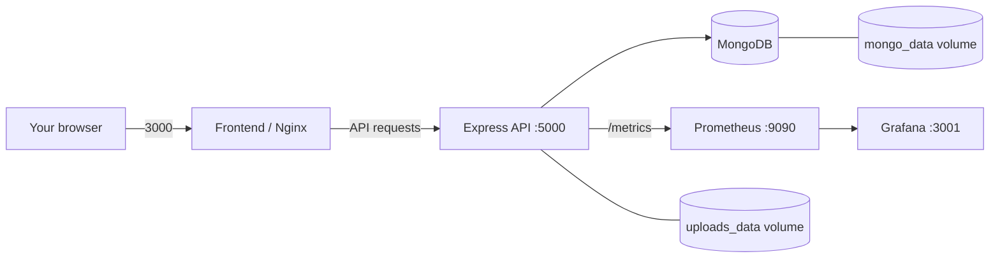

# Local DevOps and monitoring: Kali Linux runbook

This guide explains what the project's DevOps pieces do, how to run the local
application and dashboards on Kali Linux, and what still needs to be done before
a real public launch. The Compose setup is for a local development/demo machine;
it is not a production hosting recipe.

## 1. DevOps in everyday language

DevOps is a way to make building, checking, running, and observing software more
repeatable. In this project, it does not replace the shop or change customer
features. It adds tools around the existing React website, Express API, and
MongoDB database.

| Without the DevOps additions | With the DevOps additions in this repository |
|---|---|
| Install and start the website, API, and database separately. | Docker Compose can build and start the app and database together. |
| A developer must remember which tests and builds to run. | GitHub Actions runs backend checks/tests, frontend tests/build, and container image builds for configured pushes and pull requests. |
| You mostly notice failures by opening the app or reading terminal output. | Prometheus collects API metrics and Grafana displays a prebuilt API dashboard. |
| Replacing a container could lose files stored only inside it. | Named Compose volumes retain MongoDB data and uploaded images when containers are replaced. |

**What was already working:** the application itself—shopper/admin UI, API,
MongoDB integration, and local/manual development—does not depend on Grafana,
Prometheus, CI, or Kubernetes. Those tools improve how the application is built,
run, and observed; they do not add automatic online payments, public hosting,
automatic database backups, or a production alerting service.

### Benefits and limits

- **Repeatability:** the same Compose files describe the local services instead
	of relying on a hand-built setup on one computer.
- **Earlier feedback:** CI can catch test, syntax, and frontend build failures
	before a change is merged.
- **Visibility:** the dashboard shows API request rate, p95 latency, response
	rates by status, and an order counter.
- **Persistence across container replacement:** Compose named volumes retain
	MongoDB records and uploaded product images while those volumes remain.
- **Not a backup:** a volume is still on the same machine and can be deleted.
	The project does not schedule or verify off-machine backups.
- **Not public hosting:** CI builds and tests; it does not deploy this site.
	Kubernetes files are a learning/local-cluster example, not a production-ready
	database or security design.

## 2. How the local stack fits together

The application-only Compose file starts MongoDB, the API, and the frontend.
The monitoring Compose file adds Prometheus and Grafana. The API publishes
metrics; Prometheus scrapes them every 10 seconds; Grafana reads Prometheus and
loads the provisioned **IndusCart API Overview** dashboard.



## 3. Kali Linux prerequisites

Use a regular Kali installation or a Kali virtual machine with working
virtualization and internet access. Kali running inside WSL may have additional
systemd/virtualization constraints; a full Kali VM or native installation is
usually simpler for Docker Engine. The commands below install Docker from
Kali's own package repository. They need an account allowed to use `sudo`.

### Install and start Docker Engine

Open a Kali terminal and run:

```sh
sudo apt update
sudo apt install -y docker.io
sudo systemctl enable docker --now
sudo docker run --rm hello-world
```

The final command should print a Docker test-success message. These commands
follow the [official Kali Docker instructions](https://www.kali.org/docs/containers/installing-docker-on-kali/).

### Check Docker Compose v2

This project uses the Compose v2 command, `docker compose` (with a space). Check
whether it is installed:

```sh
sudo docker compose version
```

If Kali says that `compose` is an unknown Docker command, install the Compose
plugin using the [official Docker Debian installation instructions](https://docs.docker.com/engine/install/debian/).
Kali's instructions explain that Kali is rolling and the Docker Debian
repository must use the appropriate current stable Debian suite—not the literal
`kali-rolling` suite. Follow those current instructions, install
`docker-compose-plugin`, and check `sudo docker compose version` again.

The examples below use `sudo docker` so you do not have to weaken Docker socket
permissions. Docker access through the `docker` group is effectively
root-level access; only add trusted users to that group. See Docker's
[post-installation security notes](https://docs.docker.com/engine/install/linux-postinstall/).

## 4. Get the project and configure it

If you have not already cloned the repository, replace the example URL with
your own GitHub repository URL:

```sh
sudo apt install -y git
git clone https://github.com/YOUR_ACCOUNT/YOUR_REPOSITORY.git induscart
cd induscart
```

If you already have a project checkout on Kali, open a terminal in the folder
containing `docker-compose.yml` instead.

Create the local environment file only if one does not already exist, then edit
it. This avoids overwriting any settings you have already saved:

```sh
test -f .env || cp .env.example .env
nano .env
```

Generate two private random values in the Kali terminal:

```sh
openssl rand -hex 32
openssl rand -hex 24
```

Copy the first output into `JWT_SECRET` and the second into
`GRAFANA_ADMIN_PASSWORD` in `.env`. Do this locally; do not paste the values
into GitHub, chat, or a committed file. Optional email variables are only
needed for configured password-reset email delivery. The `.env` file is
ignored by Git; you can confirm with `git check-ignore .env`.

Restrict access to your local secrets:

```sh
chmod 600 .env
```

## 5. Start and check the app plus dashboards

Run all five services from the repository root:

```sh
sudo docker compose -f docker-compose.yml -f docker-compose.monitoring.yml config -q
sudo docker compose -f docker-compose.yml -f docker-compose.monitoring.yml up --build -d
sudo docker compose -f docker-compose.yml -f docker-compose.monitoring.yml ps
```

The first build downloads base images and dependencies and can take several
minutes. `ps` should show `mongo`, `backend`, `frontend`, `prometheus`, and
`grafana` running; wait for the backend health check if a dependent service is
still starting.

Open these pages in the Kali machine's browser:

| Service | Address | What to look for |
|---|---|---|
| Shopper storefront | <http://localhost:3000> | The IndusCart website loads. |
| API readiness | <http://localhost:5000/health/ready> | HTTP success means the API can reach MongoDB. |
| API metrics | <http://localhost:5000/metrics> | Plain-text metrics are returned. |
| Prometheus | <http://localhost:9090> | Open **Status → Targets** and confirm `induscart-backend` is **UP**. |
| Grafana | <http://localhost:3001> | Sign in with the local credentials set in `.env`; open the **IndusCart API Overview** dashboard. |

The Grafana dashboard may show empty or zero values until API traffic has
occurred. Refresh after using the storefront or requesting the health endpoint.
The order counter is process-local and resets when the API restarts; it is not
the authoritative order history (MongoDB is).

### Useful everyday commands

Run these from the repository root:

```sh
# Follow service logs
sudo docker compose -f docker-compose.yml -f docker-compose.monitoring.yml logs -f --tail=100

# Check status again
sudo docker compose -f docker-compose.yml -f docker-compose.monitoring.yml ps

# Stop containers but keep named data volumes
sudo docker compose -f docker-compose.yml -f docker-compose.monitoring.yml down

# Start the already-built stack again
sudo docker compose -f docker-compose.yml -f docker-compose.monitoring.yml up -d
```

**Do not append `-v` to `down`** unless you intentionally want to delete the
MongoDB database, uploaded images, and Prometheus/Grafana data volumes. Save a
backup elsewhere before any cleanup or reinstall.

## 6. What the technical pieces do

### Containers and health checks

- `docker-compose.yml` builds the backend and frontend images and uses the
	`mongo:8` image. The backend waits for MongoDB's health check; the frontend
	waits for the backend readiness check.
- `docker-compose.monitoring.yml` adds `prom/prometheus` and `grafana/grafana`.
- Compose publishes the storefront on port `3000` and API on port `5000`.
	All four host ports (`3000`, `5000`, `9090`, and `3001`) are now explicitly
	bound to loopback, so they are intended to be reached from the Kali machine
	itself, not other devices on the network.
- `mongo_data` and `uploads_data` are named volumes. They survive a normal
	`docker compose down`, but not `down -v`, disk loss, or a machine failure.

### Metrics and dashboard

The API exposes `/metrics` without authentication for Prometheus scraping. It
exports default Node.js process/runtime metrics, request-duration histograms,
and successfully created COD/manual-cash order counts. Request labels use the
HTTP method, Express route template, and response status—not raw customer/order
IDs. Prometheus uses `devops/prometheus/prometheus.yml` and scrapes every 10
seconds. Grafana provisions the Prometheus data source and dashboard from
`devops/grafana/`.

This local configuration has dashboards but does **not** configure alert
notifications, long-term remote metrics storage, or incident response. Do not
expose the unauthenticated metrics endpoint or local dashboards to the public
internet.

### Continuous integration (GitHub Actions)

`.github/workflows/ci.yml` runs on configured pushes, pull requests, or manual
dispatch. It installs locked dependencies, runs backend checks/tests with a
temporary MongoDB service, runs frontend tests and production build, and builds
the backend and frontend Docker images. It also validates the merged application
and monitoring Compose configuration using CI-only environment values. A green
check means those automated
checks passed for that commit; it does **not** mean the change was deployed or
tested on every possible machine. It does not publish images or deploy the
store.

If Node.js/npm is installed on Kali, the corresponding local checks are:

```sh
(cd backend && npm ci && npm run check && npm test)
(cd frontend && npm ci && npm test && npm run build)
```

Before pushing documentation changes, review them locally:

```sh
git status --short
git diff --check
git diff
```

Never stage `.env`, database dumps, customer data, or credentials. After
reviewing, stage only the intended source/docs files, commit, and push your
branch; then check the GitHub Actions result.

### Backups and Kubernetes: important boundaries

- The API scripts `npm run db:backup` and `npm run db:restore -- <folder>` use
	`mongodump`/`mongorestore`, a configured `backend/.env`, and MongoDB Database
	Tools. Backups are manual, not scheduled. Restore uses `--drop`, so it can
	replace collections in the target database.
- The Docker stack does not automatically back up the MongoDB volume or copy
	backups off the Kali machine. Product uploads are separate from database
	dumps. Plan and test a backup/restore process before putting real data in the
	system; keep encrypted copies on another device or approved storage.
- `k8s/` is an educational local-cluster example. It has a single MongoDB
	replica and is explicitly not a production-ready highly available or secured
	deployment. Use [`k8s/README.md`](../k8s/README.md) only if you are learning
	Kubernetes.

## 7. Security and troubleshooting

- Keep `.env` private. Replace every example secret with a unique random value.
	Do not reuse the sample JWT or Grafana credentials on a shared/public system.
- The API port is published for local use and `/metrics` is unauthenticated.
	The checked-in Compose setup binds app and dashboard ports to loopback; do not
	change that or port-forward these services from your router for a public
	deployment without adding appropriate authentication and network controls.
- If `docker compose` is missing, install the Compose v2 plugin as described
	above. If Docker reports permission denied, use the `sudo docker ...` commands
	shown here or carefully review Docker's root-equivalent group warning.
- If a service is unhealthy, inspect
	`sudo docker compose -f docker-compose.yml -f docker-compose.monitoring.yml logs --tail=100`
	and check that ports `3000`, `3001`, `5000`, and `9090` are not occupied.
- If Compose says `JWT_SECRET` is missing, make sure `.env` is in the project
	root (beside `docker-compose.yml`) and contains a non-empty value.
- If Grafana does not show the new password after a previous run, its named
	`grafana_data` volume may already contain a local Grafana account. Use
	Grafana's password-reset procedure; deleting that volume also deletes its
	local Grafana state.

## Related guides

- [Storage and backup behavior](./STORAGE_ARCHITECTURE.md)
- [Production deployment gaps and release checklist](./PRODUCTION_DEPLOYMENT.md)
- [Kubernetes learning example](../k8s/README.md)
- [Kali: installing Docker](https://www.kali.org/docs/containers/installing-docker-on-kali/)
- [Docker: Debian Engine and Compose plugin](https://docs.docker.com/engine/install/debian/)
- [Docker: Linux post-install security](https://docs.docker.com/engine/install/linux-postinstall/)
