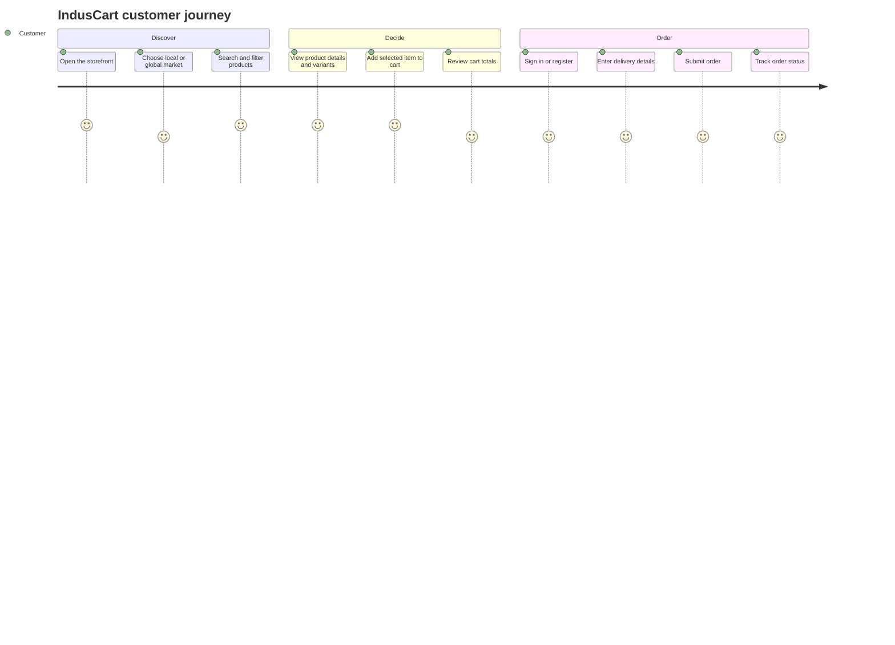
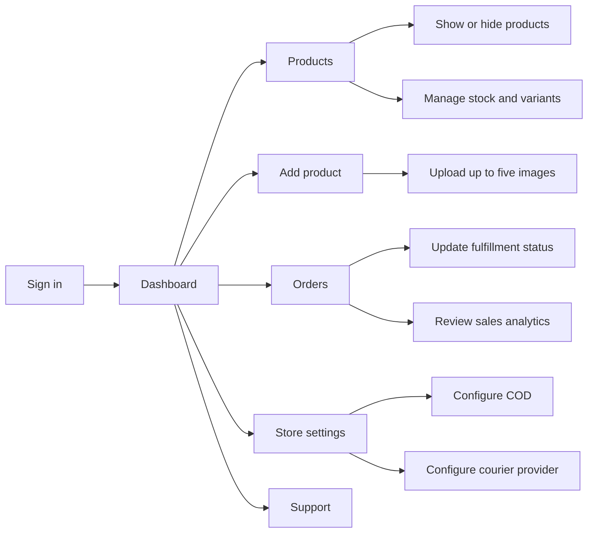

# IndusCart Project Showcase

IndusCart is more than a product list: it includes a customer storefront, a
protected admin workspace, local and international pricing, order controls,
support tools, Docker deployment, and an Android wrapper.

## Product at a glance

| Experience | What users can do |
|---|---|
| Storefront | Browse, search, filter, sort, and view visible products |
| Market modes | Shop in Pakistan/PKR mode or international/USD mode |
| Product details | Review images, variants, stock, descriptions, and delivery information |
| Cart and checkout | Select quantities and variants, review totals, address, and payment method |
| Customer account | Register, sign in, verify a session, and view orders |
| Admin workspace | Manage products, inventory, visibility, orders, analytics, settings, and support |
| Mobile | Open the responsive website on a phone or package it with Capacitor for Android |

## Customer journey

## Admin journey

## Routes worth knowing

| Route | Audience | Purpose |
|---|---|---|
| `/` | Everyone | Storefront and product discovery |
| `/login` | Everyone | Sign in |
| `/register` | Everyone | Create an account |
| `/cart` | Customer | Review cart and begin checkout |
| `/orders` | Customer | View customer orders |
| `/support` | Customer | Contact support and review help content |
| `/admin` | Admin | Dashboard and management workspace |
| `/admin/products` | Admin | Catalog and visibility management |
| `/admin/add` | Admin | Create a product with images and variants |
| `/admin/orders` | Admin | Review and update fulfillment |
| `/admin/settings` | Admin | COD, courier, shipping, and store configuration |

Protected routes redirect unauthenticated users to `/login`; admin routes also
require an administrator account.

## Capabilities that are easy to miss

  while the storefront switches between PKR and USD presentation.
  subcategories without editing source code.
  so two variants of one product cannot overwrite each other.
- **Recently viewed stays useful:** current catalog filters do not erase a
  customer's browsing history; deleted or hidden products are still excluded.
- **Market-aware catalog:** selecting All Products clears category filters but
  keeps the chosen market, so Pakistan-only products remain hidden internationally.
- **Server-side order protection:** the API rechecks visibility, stock,
  variants, and database prices during checkout instead of trusting browser
  values.
- **Product lifecycle controls:** products can be hidden from customers without
  deleting their records.
- **Configurable COD:** administrators can enable COD, set flat or percentage
  fees, and define a free-COD threshold.
- **Operational analytics:** the admin area includes revenue, order, inventory,
  market, and sales analytics views.
- **Persistent media:** product uploads are served by the backend and can be
  persisted with the Docker `uploads_data` volume.
- **Health endpoints:** `/health/live` checks process availability and
  `/health/ready` checks database readiness.
- **Database portability:** changing `MONGO_URI` moves the app between local
  MongoDB and a compatible managed provider.
- **Android reuse:** the Capacitor app packages the same React storefront
  instead of maintaining a separate mobile codebase.

## Where to explore the implementation

- Frontend routes and composition: `frontend/src/App.jsx`
- Customer storefront: `frontend/src/pages/HomePage.jsx`
- Admin workspace: `frontend/src/pages/AdminPage.jsx`
- API entry point: `backend/server.js`
- API routes: `backend/routes/`
- Database models: `backend/models/`
- API security: `backend/middleware/authMiddleware.js`
- Docker runtime: `docker-compose.yml`
- Architecture diagrams: [`ARCHITECTURE.md`](./ARCHITECTURE.md)

## Recommended GitHub reading order

1. [`README.md`](../README.md) for setup and common commands.
2. [`DOCUMENTATION_INDEX.md`](./DOCUMENTATION_INDEX.md) for the document map.
3. [`SRD.md`](./SRD.md) for requirements and release status.
4. [`ARCHITECTURE.md`](./ARCHITECTURE.md) for system diagrams.
5. [`API_REFERENCE.md`](./API_REFERENCE.md) for implemented backend routes.
6. [`USER_GUIDE.md`](./USER_GUIDE.md) for customer and admin workflows.
7. [`LOCAL_RUN_GUIDE.md`](./LOCAL_RUN_GUIDE.md) for browser, phone, and APK use.
8. [`PRODUCTION_DEPLOYMENT.md`](./PRODUCTION_DEPLOYMENT.md) before a public launch.
