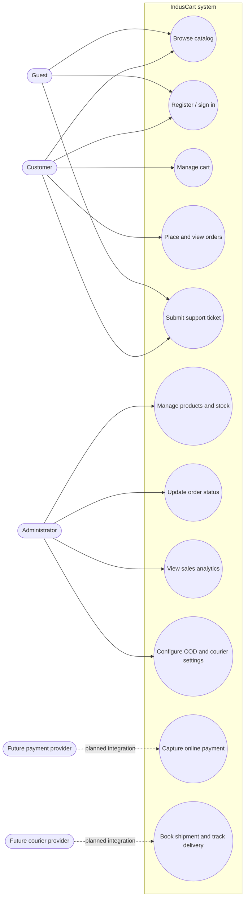
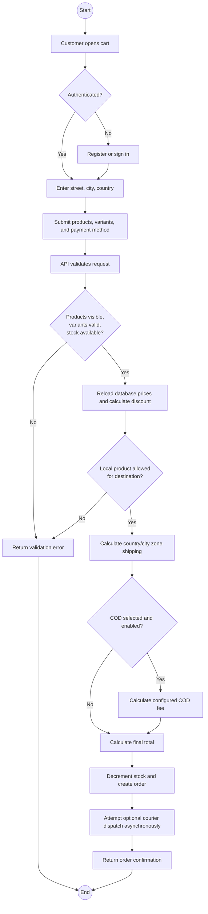
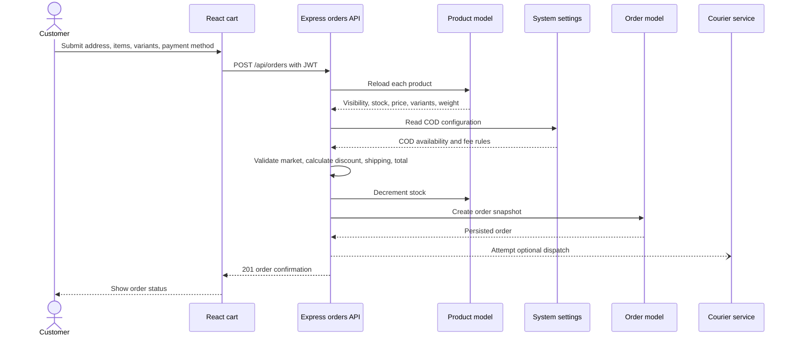
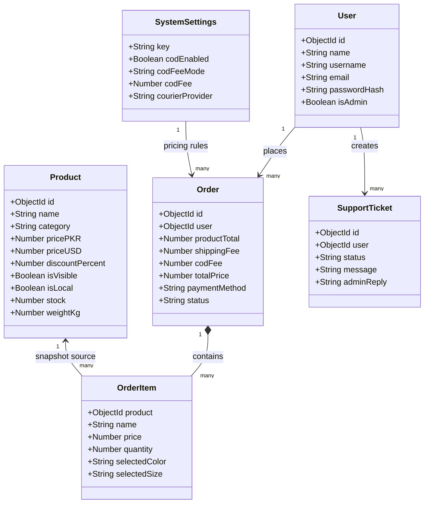
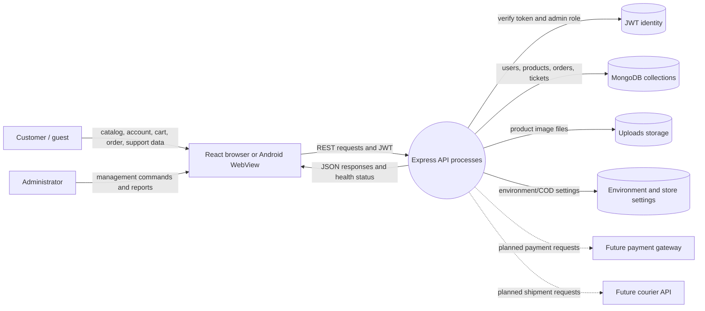
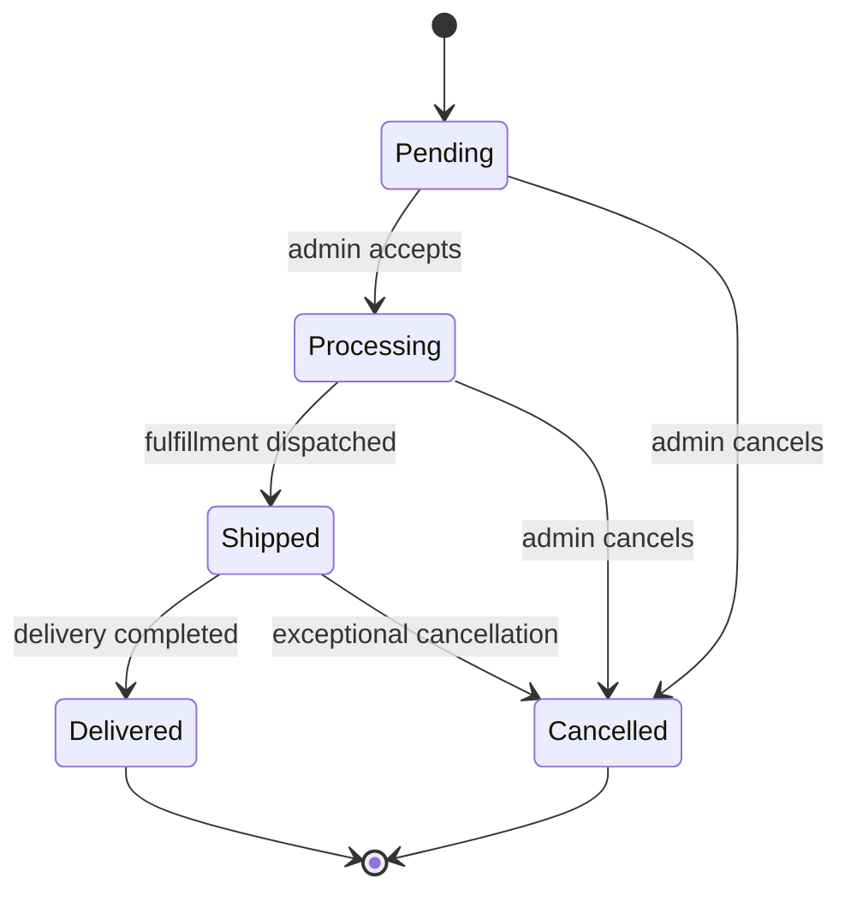

# IndusCart Software Requirements Document

**Version:** 1.0  
**Audit basis:** Repository implementation reviewed September 2026  
**Status:** Functional MVP / pre-production

## 1. Purpose

IndusCart is a Pakistan-focused e-commerce platform with an international
selling mode. It provides a customer storefront, account authentication,
variant-aware cart and checkout, order status tracking, support tickets, and a
protected administrator workspace.

This document defines the current scope, requirements, acceptance criteria,
constraints, and release gaps. A requirement marked **Implemented** is present
in the repository. **Partial** means the user interface or data model exists
but the complete external integration or operational behavior is missing.
**Planned** means it should not be presented as available functionality.

## 2. Goals and stakeholders

### Goals

1. Let customers discover visible products and place validated orders.
2. Support Pakistan/PKR and international/USD catalog presentation.
3. Give administrators control over catalog, inventory, orders, settings, and
   operational analytics.
4. Keep the same React application usable in browsers, Docker, and Android.
5. Protect prices, stock, authentication, and administrator operations on the
   server.

### Stakeholders

| Stakeholder | Primary needs |
|---|---|
| Customer | Discover products, select variants, order, track status, get support |
| Administrator | Manage products, stock, orders, settings, analytics, tickets |
| Fulfillment operator | Process order statuses, COD, shipping, and future courier dispatch |
| Business owner | Control market availability, pricing, policies, and integrations |
| Developer/maintainer | Run, test, document, deploy, back up, and recover the system |

## 3. Scope

### In scope

- Responsive React/Vite storefront and admin UI
- User registration, login, JWT session verification, and admin authorization
- Product catalog, categories, dynamic subcategories, images, variants, stock,
  visibility, discounts, and local/global market rules
- Persistent browser cart with product/color/size identity
- Server-side order validation, zone shipping, COD fees, stock decrement, and
  order status lifecycle
- Customer and guest support tickets with admin replies/status updates
- Sales analytics and manual cash-sale recording
- MongoDB persistence, local uploads, Docker Compose, health checks, backups,
  Capacitor Android packaging, and GitHub validation/APK workflows

### Out of scope for the current release

- Real payment capture, webhooks, refunds, and payment reconciliation
- Real courier booking, labels, tracking, and delivery webhooks
- Automated returns/refunds workflow
- Email, SMS, push, and transactional notifications
- Public production hosting, object storage, monitoring, and legal sign-off
- Multi-vendor settlement, reviews, wishlists, coupons, and advanced marketing

## 4. SRS visual models

These diagrams are intentionally based on the implemented repository. They use
GitHub-compatible Mermaid and should be updated when requirements or routes
change. UML guidance separates structural views such as class/component models
from behavioral views such as use case, activity, sequence, and state models;
the data-flow view below documents movement between actors, processes, and
stores.

### 4.1 Use-case view

`Capture` and `Dispatch` are deliberately shown as future integrations, not
as completed capabilities.

### 4.2 Checkout activity diagram

### 4.3 Checkout sequence diagram

### 4.4 Domain class model

### 4.5 Level-1 data-flow diagram

### 4.6 Order state diagram

This diagram describes the intended fulfillment journey. The current admin/API
still permits any enumerated status value; it does not enforce this graph.

### 4.7 Diagram coverage and missing views

| View | Status | Notes |
|---|---|---|
| Use case | Added | Actors and implemented/planned interactions |
| Activity | Added | Checkout validation and order creation |
| Sequence | Added | Browser-to-API checkout collaboration |
| Class/domain | Added | Mongoose domain model relationships |
| ER/data model | Added | See `ARCHITECTURE.md` |
| Data flow | Added | Level-1 actors, processes, stores, integrations |
| State machine | Added | Order lifecycle |
| Component/deployment | Added | See `ARCHITECTURE.md` |
| Timing diagram | Not needed yet | Add only when latency/SLA timing becomes a requirement |
| Communication diagram | Not needed yet | Sequence diagram currently communicates the same integration path |
| Payment/courier detailed flows | Missing | Add after real providers and webhooks are selected |
| Returns/refunds activity | Missing | Add when the returns domain model and workflow are implemented |

The standalone implementation-based UML set is maintained in
[`UML_DIAGRAMS.md`](./UML_DIAGRAMS.md); this SRD section retains the
requirements-level behavioral models.

## 5. Functional requirements

| ID | Requirement | Status | Acceptance summary |
|---|---|---|---|
| FR-01 | Register with account details | Implemented | Valid name/email/password creates a user and returns JWT |
| FR-02 | Login with email or username | Implemented | Valid credentials return a 30-day JWT session |
| FR-03 | Verify authenticated session | Implemented | Protected session endpoint returns current user |
| FR-04 | Restrict admin operations | Implemented | JWT user must have `isAdmin` for admin API routes |
| FR-05 | Browse visible catalog | Implemented | Public routes exclude hidden products |
| FR-06 | Search/filter/sort catalog | Implemented | UI supports text, category, market, and sort controls |
| FR-07 | Manage product details and variants | Implemented | Admin can set prices, images, category, brand, model, colors, sizes, stock, weight |
| FR-08 | Apply scheduled discounts | Implemented | Discount percentage and inclusive start/end dates are validated server-side |
| FR-09 | Maintain a variant-aware cart | Implemented | Product plus selected color/size identifies a cart line |
| FR-10 | Validate and create orders | Implemented | Server rechecks product, stock, visibility, price, variants, address, and payment method |
| FR-11 | Calculate zone shipping and COD fees | Implemented | Server calculates weight/zone shipping and configured COD fees |
| FR-12 | Track order lifecycle | Implemented | Pending, Processing, Shipped, Delivered, Cancelled are persisted and displayed |
| FR-13 | Capture online payment | Partial | Payment methods exist, but no provider capture/webhook/refund exists |
| FR-14 | Dispatch to courier | Partial | Settings and service seam exist; provider adapter is not implemented |
| FR-15 | Customer order history | Implemented | Authenticated user can list and view authorized orders |
| FR-16 | Support tickets | Implemented | Guest/user creation, user list, admin list, reply, and status endpoints exist |
| FR-17 | Admin sales analytics | Implemented | Revenue, channel, period, product, hour, day, and region aggregates exist |
| FR-18 | Manual cash-sale recording | Implemented | Admin can record a cash sale without a catalog product |
| FR-19 | Store settings | Implemented | Admin can configure COD and courier settings; public API exposes checkout-safe fields |
| FR-20 | Public health checks | Implemented | Live and readiness endpoints report process/database state |
| FR-21 | Android package | Implemented | Capacitor packages the web build; public HTTPS API is required outside local Wi-Fi |
| FR-22 | Automated build validation | Implemented | GitHub Actions validates backend syntax/tests and frontend tests/build |
| FR-23 | Automated APK artifact | Implemented | Tag/manual workflow builds debug APK when `VITE_API_URL` is a public HTTPS URL |
| FR-24 | Returns/refunds workflow | Planned | Requires model, API, UI, eligibility, approval, refund, and stock rules |
| FR-25 | Notifications | Planned | Requires email/SMS/push provider, templates, retry, and preferences |

## 6. Core business rules

1. Hidden products remain in the admin catalog but are excluded from public
   product responses.
2. Pakistan-only products cannot be ordered for a non-Pakistan country.
3. Pakistan orders use PKR product prices; other countries use USD product
   prices. Shipping uses server-side zone rates.
4. Discounts are active only within their optional inclusive date range.
5. The API calculates order prices from the database and does not trust browser
   prices.
6. Public catalog requests cannot reveal hidden products; hidden catalog data is
   available only to authenticated administrators.
7. COD can be disabled and can use a flat or percentage fee with an optional
   product-total threshold.
8. Cancelling an order restores stock; other concurrent stock reservations need
   a transaction/atomic update improvement before high-volume production.
9. A courier failure must not fail order creation; the current service reports
   `not_configured` or `provider_not_supported`.
10. Payment method selection is not payment settlement. Non-COD methods must not
   be described as captured payments until a provider is integrated.

## 7. Non-functional requirements

| Area | Current behavior | Production target |
|---|---|---|
| Security | Helmet, CORS, JWT, bcrypt, auth rate limit, body limit | Request schemas, audit logs, refresh/revocation, webhook signatures, secret rotation |
| Availability | Docker health checks and API readiness endpoint | Public monitoring, alerts, redundancy, restore drills |
| Data durability | MongoDB backup/restore scripts and Docker volumes | Encrypted off-host scheduled backups and tested recovery |
| Performance | Vite build and MongoDB API | Pagination, indexes, image CDN, code splitting, load testing |
| Accessibility | Responsive React interface | Keyboard, screen-reader, contrast, and automated accessibility audit |
| Mobile | Capacitor Android wrapper | Public HTTPS API, signed release, device matrix, offline/error UX |
| Observability | Console errors and health endpoints | Central logs, error tracking, metrics, alerting, sensitive-data filtering |

## 8. Environments

| Environment | Frontend API URL | Data | Purpose |
|---|---|---|---|
| Local | `http://localhost:5000` | Local MongoDB | Development |
| LAN test | `http://YOUR_COMPUTER_IP:5000` | Local MongoDB | Same Wi-Fi phone testing |
| CI | Repository variable for APK; no production secrets in normal CI | Ephemeral | Validation/build artifacts |
| Production | Public `https://api.example.com` placeholder | Managed MongoDB | Real customers after release sign-off |

## 9. Release gates

The release must not be called production-ready until:

- Public HTTPS API and database are deployed and tested.
- At least one real payment provider has capture, webhook, idempotency, and
  refund tests.
- Courier behavior is either implemented or removed from customer promises.
- Upload storage, backups, monitoring, rate limits, and recovery are ready.
- Legal documents contain real business identity and have been reviewed.
- Android release is signed, tested on real devices, and built with public API.
- CI checks and required human review pass for the `main` branch.

## 10. Traceability and evidence

- API entry point: `backend/server.js`
- Routes: `backend/routes/`
- Controllers: `backend/controllers/`
- Models: `backend/models/`
- Authentication: `backend/middleware/authMiddleware.js`
- Frontend routes: `frontend/src/App.jsx`
- Admin API operations: `frontend/src/pages/admin/adminApi.js`
- Local tests: `backend/test/`, `frontend/src/tests/`
- CI: `.github/workflows/ci.yml`
- Android build: `.github/workflows/android-apk.yml`
