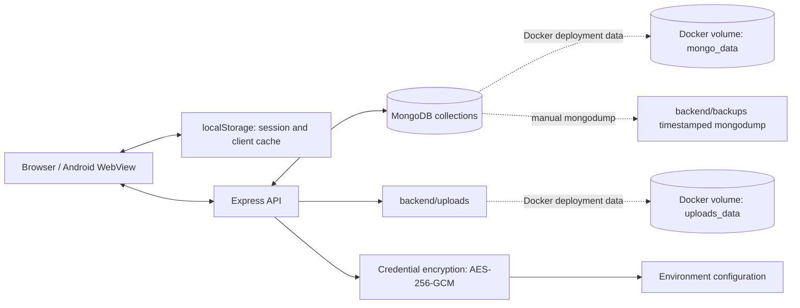

# Storage Architecture

This document describes storage that exists in the repository today. It distinguishes persistent data stores from caches, encryption, and deployment volumes; these are related concerns, not seven independent storage layers.

## System view

## MongoDB

`MONGO_URI` selects the Mongo-compatible database. The local example points to `mongodb://127.0.0.1:27017/induscart`; Docker Compose defaults to its `mongo` service. Mongoose currently defines seven models/collections:

| Model / usual MongoDB collection | Stored data and implementation notes |
|---|---|
| `User` / `users` | Account/profile fields, bcrypt-hashed password, hidden password-reset token hash/expiry, plus embedded `cart` and `wishlist` arrays. Username and email have unique schema constraints; username is sparse. |
| `Product` / `products` | Catalog text, category/brand/model, PKR/USD prices, discount dates, variants, stock, weight, visibility/market flags, and uploaded-image path strings. Indexes cover category, visibility/locality/creation date, and text search. |
| `Order` / `orders` | Customer, item snapshots, address, product total, coupon code/discount, currency, shipping/COD fees, total weight/zone, payment and fulfillment state, manual tracking, and manual cash fields. Item subdocuments snapshot product/price/discount/quantity/image/variants/weight. |
| `Coupon` / `coupons` | Uppercase code, description, discount type/value/currency, minimum, expiry, usage limit/count, and active state. |
| `Review` / `reviews` | Product/user, integer 1–5 rating, comment, moderation state. A unique `{ product, user }` index enforces one review per user/product; a second index supports product/status/date queries. |
| `SupportTicket` / `supporttickets` | Optional user, contact details, subject/message/order ID, status, admin reply, and resolution time. Current support API reads/writes MongoDB. |
| `SystemSettings` / `systemsettings` | Global COD settings and courier/EasyPaisa configuration. Provider API-key fields are `select: false`; new secret writes are encrypted before MongoDB persistence. |

Mongoose pluralizes model names for collection names as shown. Cart and wishlist are not separate collections: a signed-in user's entries are stored in that user's document. Product and order data are separate documents.

Order pricing semantics are important: `productTotal` is the discounted item subtotal before a coupon; `couponDiscount` is stored separately; `totalPrice` is calculated as `max(0, productTotal - couponDiscount) + shippingFee + codFee`. The schema lists several possible payment-method enum values for historical/manual records, but the current shopper checkout API accepts COD only; online payment capture is not implemented.

## Uploaded images and database backups

### Product images

The product API writes files under `backend/uploads/` using a timestamp, random suffix, and original extension. Multer accepts JPG/JPEG, PNG, and WebP, limits each file to 5 MiB, and accepts at most five images per product. The upload middleware also checks file signatures. Product deletion removes associated image files; update paths remove discarded or failed uploads.

In Docker Compose, `uploads_data` is mounted at `/app/uploads`, so uploads survive container replacement while the named volume remains intact.

### Database backups

`npm run db:backup` runs `mongodump` into `backend/backups/<timestamp>/`. The script does not create a JSON metadata manifest and does not schedule backups. `npm run db:restore -- <folder>` uses `mongorestore --drop`, which drops matching collections before restoring; verify the target and keep an independent backup before running it.

Docker Compose does **not** mount `backend/backups` or `/app/backups` as a volume. A backup created inside a replaceable container is therefore not a durable backup strategy. For Docker/production, write or copy dumps to storage outside the container and test restores regularly.

## Browser localStorage

The browser store is a mix of session state, guest data, account caches, and compatibility settings. It is not the sole source of truth for signed-in cart/wishlist data.

| Key | Current role |
|---|---|
| `user` | Serialized signed-in user/session object, including the JWT used by the API client. It is cleared on logout or invalid session. Treat it as sensitive session data. |
| `cart` | Guest-cart cache. |
| `cart_<userId>` | Per-user browser cache; signed-in cart is synchronized through `/api/cart` and stored on the `User` document. |
| `wishlist` | Guest wishlist cache. |
| `wishlist_<userId>` | Per-user browser cache; signed-in wishlist is synchronized through `/api/wishlist` and stored on the `User` document. |
| `cart_owner_id` | Owner marker used to avoid merging guest data belonging to a different account. |
| `recentlyViewed` | Local list of up to eight recently viewed products; stale entries are filtered. |
| `ic_theme_preference` | Active light/dark theme preference. The DOM attribute is `document.documentElement.dataset.theme`; it is not itself a storage key. |
| `ic_admin_theme` | Admin theme compatibility/fallback key; the shared navbar prefers `ic_theme_preference`. |
| `ic_admin_last_section` | Last selected admin section. |
| `ic_market_mode` | Local/global storefront market selection. |
| `ic_usd_rate` | Browser-side exchange-rate setting. |
| `ic_zone_rates` | Browser-side zone shipping-rate overrides used for display. The server independently recalculates order shipping. |
| `ic_shipping_rates`, `ic_weight_rates` | Legacy pricing settings retained by compatibility helpers; these are not the current zone-rate source used by cart shipping. |
| `ic_support_tickets` | Legacy local-ticket utility storage. The current support page uses the API/MongoDB path; do not treat this key as the authoritative ticket store. |

`checkout_address` is only removed during authentication persistence; current code does not write checkout addresses to it. `admin_active_tab` is not the active key; the current key is `ic_admin_last_section`.

## Provider-secret encryption

`SystemSettings.courierApiKey` and `SystemSettings.easypaisaApiKey` are stored in the same MongoDB settings document, not in a separate vault service. `backend/config/credentialVault.js` derives a 32-byte key with scrypt from `SETTINGS_ENCRYPTION_KEY` and the fixed salt `induscart-settings-v1`, then encrypts values with AES-256-GCM and a random 12-byte IV. The encoded value is `enc:v1:<base64-iv>:<base64-auth-tag>:<base64-ciphertext>`.

`SETTINGS_ENCRYPTION_KEY` must be at least 32 characters to save provider secrets; it is not one of the two environment variables required simply to start the API. The settings controller can migrate legacy plaintext provider values when settings are loaded and an encryption key is configured. Never rotate this key without a migration/re-encryption plan and a protected backup. Saved provider settings do not activate online checkout or courier integration by themselves.

## Environment and Docker configuration

| Variable / volume | Purpose |
|---|---|
| `MONGO_URI` | Required backend MongoDB connection string. |
| `JWT_SECRET` | Required JWT signing secret; production/staging validation requires at least 32 characters and rejects known placeholders. |
| `PORT` | Backend port; defaults to 5000 in local setup. |
| `CORS_ORIGINS` | Optional comma-separated browser-origin allowlist. |
| `FRONTEND_URL` | Backend base URL used in password-reset links. |
| `RESEND_API_KEY`, `EMAIL_FROM` | Optional server-side password-reset email delivery configuration. |
| `SETTINGS_ENCRYPTION_KEY` | Required only when writing encrypted provider secrets; keep stable and private. |
| `VITE_API_URL` | Frontend build/development API base URL. In Docker it is supplied as a frontend build argument. |
| `DOCKER_MONGO_URI` | Optional Compose override for the backend's MongoDB URI. |
| `mongo_data` | Compose named volume mounted at MongoDB's `/data/db`. |
| `uploads_data` | Compose named volume mounted at backend `/app/uploads`. |

`.env` files are runtime configuration, not durable secret-management services. Keep them out of version control and use a managed secret store in production.

## Corrections to the supplied overview

The supplied overview is a useful starting map, but it should not be called an exhaustive file inventory or copied unchanged:

- Its storage diagram names six boxes while the prose calls them seven distinct layers. MongoDB, files, and browser storage are persistence locations; Docker volumes are deployment backing for two of those; encryption and environment variables are controls/configuration, not independent data stores.
- Backups are `mongodump` output; there is no JSON metadata manifest, automated schedule, or Docker backup volume in the current implementation.
- Signed-in carts and wishlists are server-synchronized and live in embedded `User` fields; guest copies and browser caches use localStorage.
- The active admin section key is `ic_admin_last_section`; `admin_active_tab` is not used. `checkout_address` is cleanup-only, not a current saved address.
- The listed order fields omit `couponCode`, `couponDiscount`, and `currency`; `shippingProvider` is the model field name (not `courierProvider` on `Order`), and the total includes coupon discount, shipping, and COD fee as documented above.
- The settings model also contains courier/EasyPaisa enabled/mode fields. Those provider settings are scaffolding; they do not enable online payments or a production courier integration.
- The file list is a curated module overview, not every file. It omits, among other things, all route modules and the `Coupon` and `Review` models. The current scoped source counts are recorded in [`UML_DIAGRAMS.md`](./UML_DIAGRAMS.md); dependencies and generated/user data are excluded.
