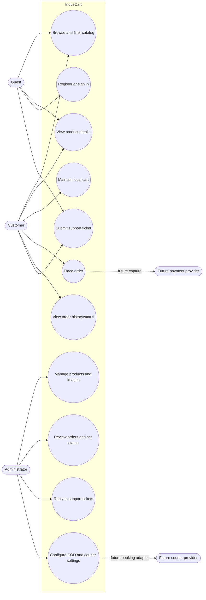
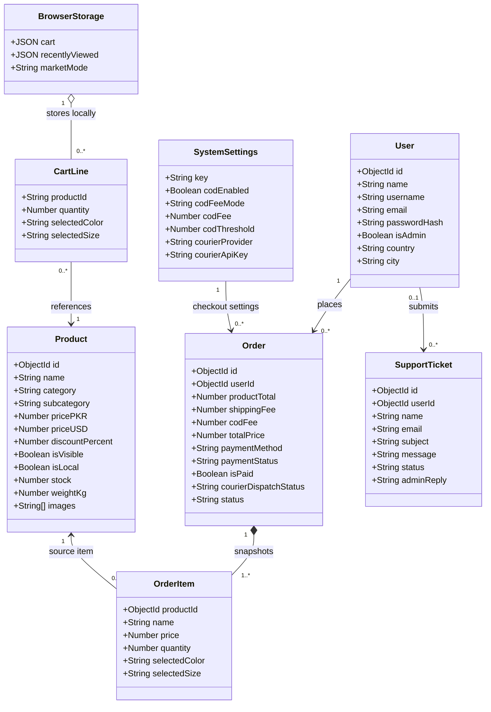
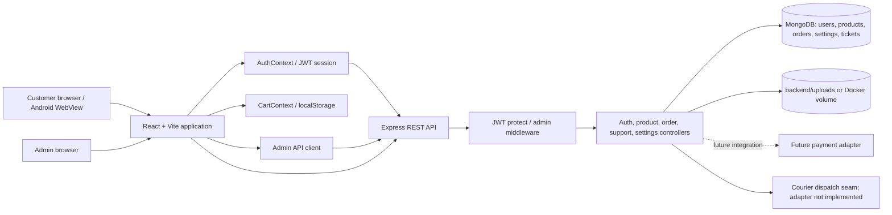
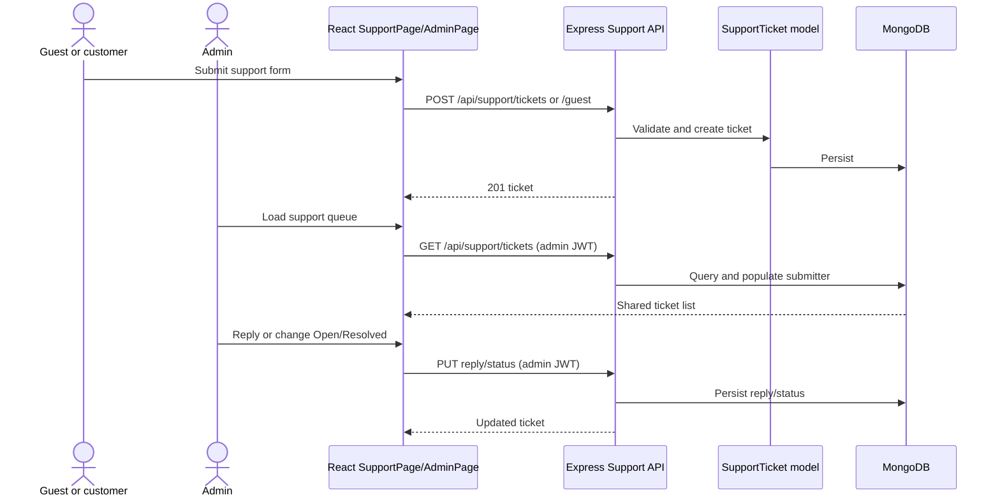
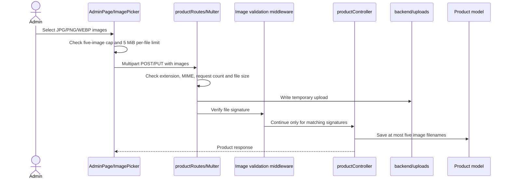

# IndusCart UML Diagrams

These diagrams document the repository as implemented, not an idealized future system. Mermaid renders them in GitHub. Payment-provider capture and courier booking are shown as future integrations; support tickets are stored by the current Express/MongoDB API. The cart and recently viewed list are browser-local.

## 1. Use-case diagram



## 2. Domain class diagram



**Storage distinction:** `CartLine` and `BrowserStorage` are conceptual browser state, not MongoDB models. `Order` and `SupportTicket` are persisted server-side. Courier keys are excluded from normal settings responses; they are not currently encrypted at rest.

## 3. Component diagram



## 4. Checkout sequence

```mermaid
sequenceDiagram
    actor Customer
    participant UI as React CartPage
    participant Cart as CartContext/localStorage
    participant API as Express Orders API
    participant Product as Product model
    participant Settings as SystemSettings
    participant Order as Order model
    participant Courier as Courier service

    Customer->>UI: Confirm address and method
    UI->>Cart: Read local cart lines
    UI->>API: POST /api/orders with JWT and product IDs/quantities
    API->>Product: Reload products and validate visibility, market, variants, stock
    Product-->>API: Current prices, stock, variants, weight
    API->>Settings: Read COD configuration
    API->>API: Calculate prices, shipping, fees and paymentStatus=pending
    API->>Product: Reserve/decrement stock
    API->>Order: Create order snapshot
    Order-->>API: Persisted order
    API--)Courier: Attempt async dispatch (currently not_configured/unsupported)
    API-->>UI: 201 order and pending payment status
    UI->>Cart: Clear cart after successful order
    UI-->>Customer: Confirmation; online payment is not claimed as captured
```

## 5. Support-ticket sequence



## 6. Product upload sequence



## 7. Order status and payment notes

The enum values are `Pending`, `Processing`, `Shipped`, `Delivered`, and `Cancelled`. The current API validates the enum but does **not** enforce a transition graph. Cancellation from Pending/Processing restores stock; cancellation after Shipped remains allowed but does not restore stock. `paymentStatus` is separate from fulfillment: non-COD methods are pending until a payment integration updates them. Courier dispatch state is recorded, but no carrier booking adapter exists.

For the requirements-oriented diagrams and acceptance criteria, see [`SRD.md`](./SRD.md). For runtime/deployment diagrams, see [`ARCHITECTURE.md`](./ARCHITECTURE.md).
