# IndusCart UML Diagrams

These diagrams document the repository as implemented, not an idealized future system. Mermaid renders them in GitHub. Payment-provider capture and courier booking are shown as future integrations; support tickets are stored by the current Express/MongoDB API. Guest carts and recently viewed items are browser-local; signed-in carts and wishlists are synchronized with the API and stored on the user's MongoDB document, with local browser caches. Customer password reset uses a one-time, 20-minute link delivered through Resend when configured.

## Repository inventory snapshot

The source inventory was checked against this repository before updating these
diagrams. The counts are files, not lines of code; generated build output,
`node_modules`, Android build artifacts, and uploaded images are excluded.

| Area | Files found | Notes |
|---|---:|---|
| Backend JS/JSON/Markdown files | 64 | Runtime, API, schemas, scripts, tests, and manifests; excludes `node_modules`, backups, and uploads |
| Frontend `src` JS/JSX/TS/TSX/CSS files | 44 | Routes, pages, components, contexts, utilities, styles, and tests |
| UML sections in this guide | 25 | Sections 1–16 reviewed/corrected plus 17–25 for code structure and current workflows |

For GitHub review, start with sections 1–4 for actors, domain data, components
and routes; then use the workflows in sections 5 onward.

## 1. Use-case diagram

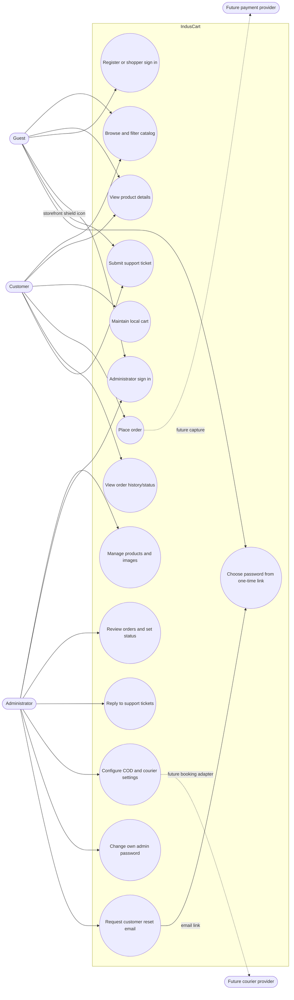

## 2. Domain class diagram

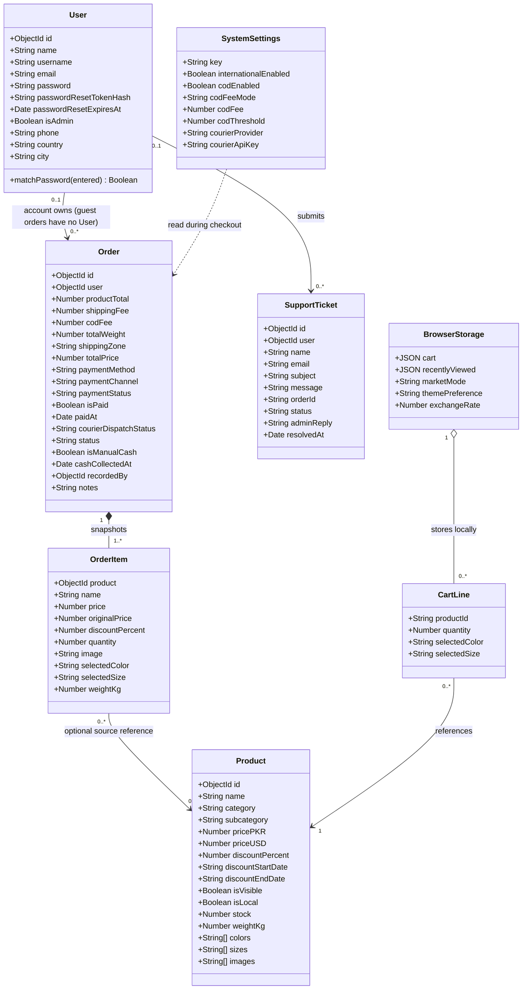

**Storage distinction:** `CartLine` and `BrowserStorage` are conceptual browser state, not MongoDB models. `OrderItem` is an embedded subdocument in `Order`, not a separate collection; manual cash items may have a null `Product` reference. `SystemSettings` is read while creating an order but has no persisted relation to it. Password reset token hashes/expiry are hidden `User` fields. Courier keys are excluded from normal settings responses and encrypted at rest when `SETTINGS_ENCRYPTION_KEY` is configured.

## 3. Component diagram

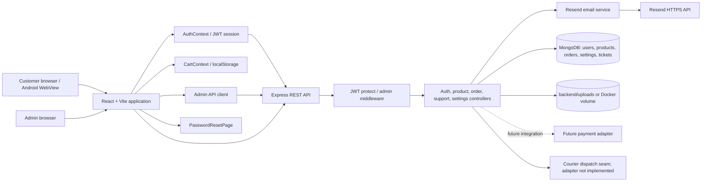

## 4. Checkout sequence

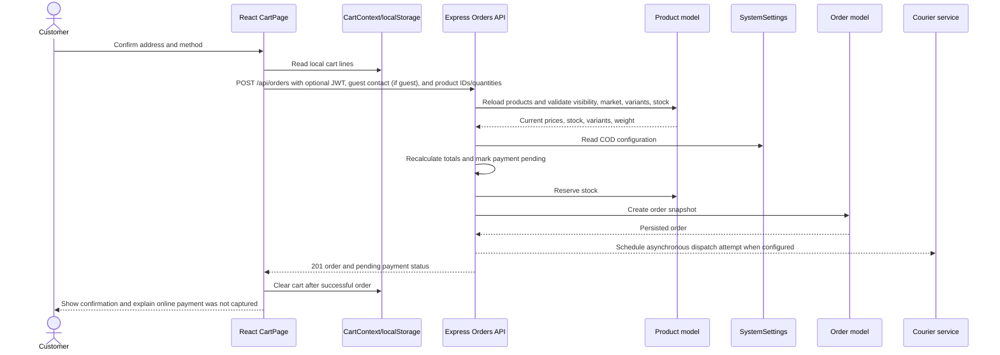

## 5. Support-ticket sequence

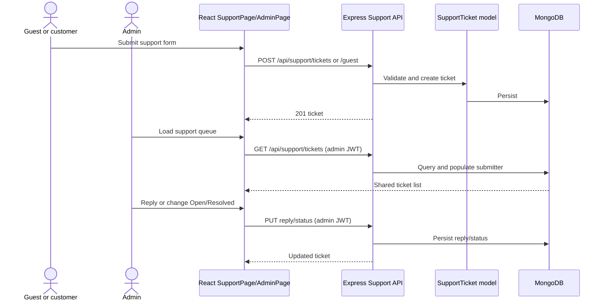

## 6. Product upload sequence

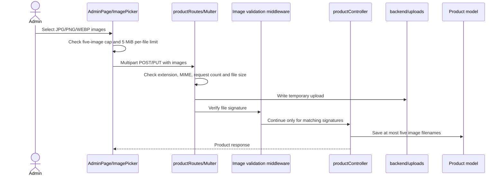

## 7. Order status and payment notes

The enum values are `Pending`, `Processing`, `Shipped`, `Delivered`, and `Cancelled`. The current API validates the enum but does **not** enforce a transition graph. Cancellation from Pending/Processing restores stock; cancellation after Shipped remains allowed but does not restore stock. `paymentStatus` is separate from fulfillment: non-COD methods are pending until a payment integration updates them. Courier dispatch state is recorded, but no carrier booking adapter exists.

## 8. Package diagram

This package view groups the current code by responsibility. It is a Mermaid flowchart representation of UML packages, not a separate deployable-service map.

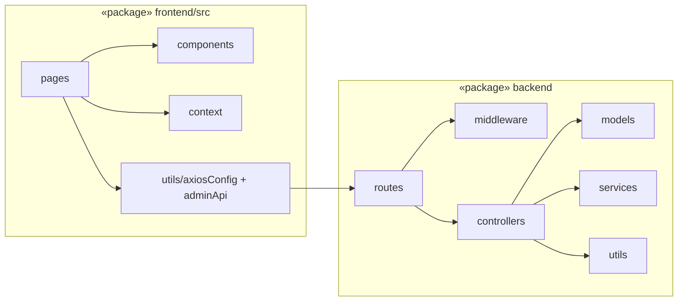

## 9. Deployment diagram

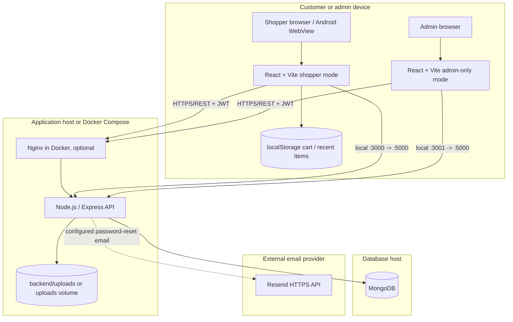

In local development Vite serves the UI and Express serves the API. In the Docker setup Nginx serves the frontend and proxies API requests; MongoDB and uploads use persistent Docker volumes. Public production hosting, shared object storage, and HTTPS remain deployment requirements, not claims made by this diagram.

## 10. Checkout activity diagram

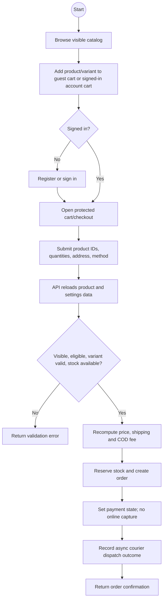

## 11. Object/instance snapshot

This example shows the relationship between stored Mongo documents and browser-only state at one point in time. Values are illustrative, not production records.

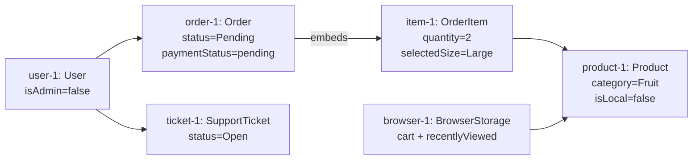

## 12. Communication/collaboration diagram

The numbered messages show the participating objects and their responsibilities for an order. The checkout sequence above gives the same collaboration in time order.

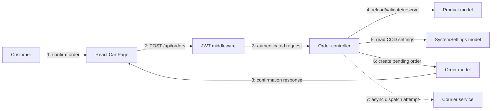

## 13. Interaction overview

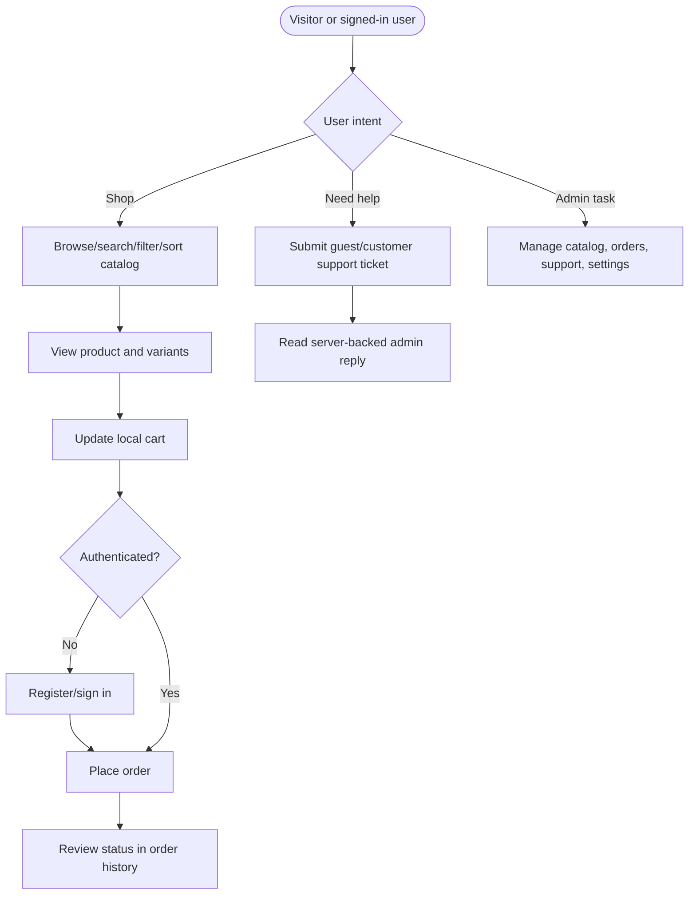

## 14. Order status state model

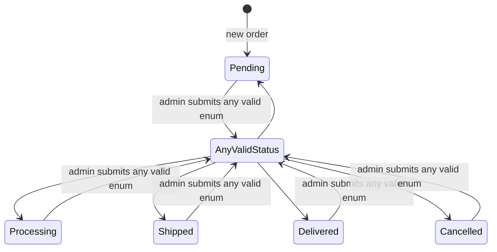

This intentionally reflects current behavior rather than an ideal workflow: the API accepts any enumerated status value and does not enforce a transition graph. Stock is restored only when cancellation occurs from Pending or Processing; cancelling after shipment does not restock.

## 15. Timing/async dispatch view

The repository has no courier SLA or delivery-time implementation, so this is an ordering view only; it does not assert elapsed times.

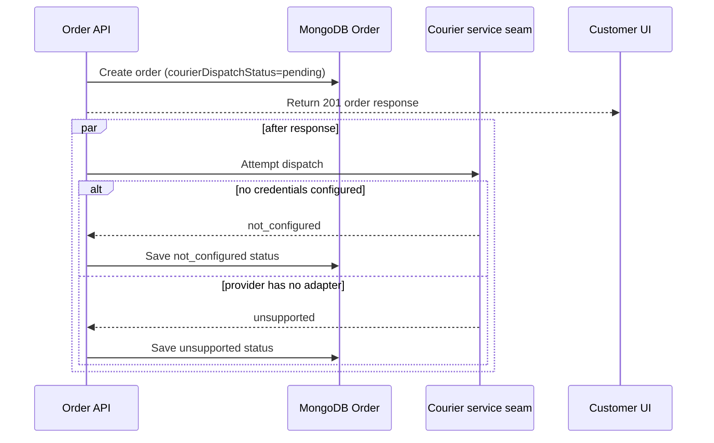

## 16. UML diagram coverage and notation limits

| UML view | Included here or elsewhere | Notes |
|---|---|---|
| Use case | Section 1 | Mermaid flowchart notation represents actors and use cases. |
| Class | Sections 2 and 23; `SRD.md` | Domain entities, embedded order items, browser-local state, and persistence boundaries. |
| Object | Section 11 | Illustrative instance snapshot using Mermaid nodes. |
| Package | Section 8 | Mermaid grouped flowchart; source packages are not runtime services. |
| Component | Section 3; `ARCHITECTURE.md` | Application and persistence boundaries. |
| Composite structure | Not separately modeled | Internal React/API parts are represented in the component/package views; no plug-in ports are defined. |
| Deployment | Section 9; `ARCHITECTURE.md` | Local and Docker nodes; public production hosting is future work. |
| Activity | Section 10; `SRD.md` | Checkout validation and order creation. |
| State machine | Section 14; `SRD.md` | Current enum behavior, explicitly not a constrained workflow. |
| Sequence | Sections 4–6 | Checkout, support, and uploads. |
| Communication | Section 12 | Numbered collaboration messages. |
| Interaction overview | Section 13 | High-level user journey combining interactions. |
| Timing | Section 15 | Async courier attempt ordering only; no timing/SLA guarantees. |
| Repository/package inventory | Sections 17, 24 | Source folders and workspace file counts (not LOC). |
| Frontend route/access map | Section 18 | Routes, providers, guards, page and API dependencies. |
| Backend route authorization map | Sections 19–20 | Route prefixes, middleware and persistence boundaries. |
| Password reset sequence/state | Sections 21–22 | Resend delivery, hashed token, expiry and single-use completion. |
| Profile | Not applicable | The project defines no UML metamodel profiles or custom stereotypes. |

Mermaid does not provide native UML glyphs for every diagram family. Where noted, flowcharts are readable UML-inspired views. For strict UML modeling/exchange, maintain equivalent models in a UML tool and export PlantUML/XMI as needed.

For the requirements-oriented diagrams and acceptance criteria, see [`SRD.md`](./SRD.md). For runtime/deployment diagrams, see [`ARCHITECTURE.md`](./ARCHITECTURE.md); for implemented/partial/missing features, see [`FEATURE_COVERAGE.md`](./FEATURE_COVERAGE.md).

## 17. Repository package and source map

```mermaid
flowchart TB
        Repo[IndusCart repository]
        Repo --> Backend[backend: Express API]
        Repo --> Frontend[frontend: React/Vite app]
        Repo --> Docs[docs: requirements, guides, QA and diagrams]
        Repo --> Ops[docker-compose.yml, CI, security and contribution files]

        Backend --> Server[server.js]
        Backend --> Config[config: env, DB, API URL helper]
        Backend --> Routes[routes: auth, cart, coupons, orders, products, reviews, settings, support, wishlist]
        Backend --> Middleware[middleware: JWT/admin, image upload checks]
        Backend --> Controllers[controllers: auth, cart, coupons, orders, products, reviews, settings, support, wishlist]
        Backend --> Models[models: User, Product, Order, Coupon, Review, SupportTicket, SystemSettings]
        Backend --> Services[services: email/Resend, courier seam]
        Backend --> Utils[utils: pricing, status, images, analytics, cash sales]
        Backend --> Scripts[scripts: admin, backup, restore]
        Backend --> Tests[test: unit, API integration, browser smoke]

        Frontend --> App[App.jsx: router and providers]
        Frontend --> Pages[pages: shop, detail, auth, cart, orders, support, admin]
        Frontend --> Components[components: navbar, brand, product card, error boundary]
        Frontend --> Context[context: auth and cart/localStorage]
        Frontend --> ApiUtils[utils: axios config, prices and shipping]
        Frontend --> UiTests[tests: routes, cart, error boundary]
```

The current scoped source inventory is 64 backend JS/JSON/Markdown files and 44
frontend `src` JS/JSX/TS/TSX/CSS files. Backend counts exclude `node_modules`,
backups, and uploads; frontend counts are limited to `frontend/src`. Generated
`dist`, Android build outputs, and other binary/generated content are excluded.

## 18. Frontend route, guard and provider diagram

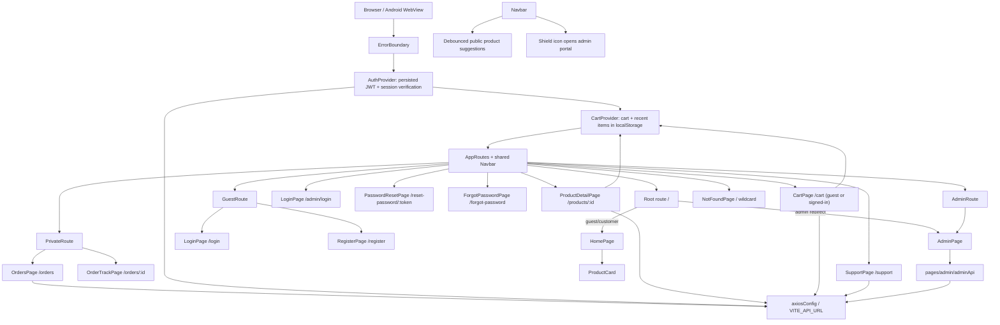

`GuestRoute` redirects authenticated users away from login/register;
`PrivateRoute` requires a user; `AdminRoute` additionally requires `isAdmin`.
The storefront shield opens the distinct admin route; login UI separation is
backed by different API endpoints and server-side role checks.
The reset-link route is intentionally public and accepts only the expiring
one-time token; it does not create a logged-in session.

## 19. Backend request and persistence architecture

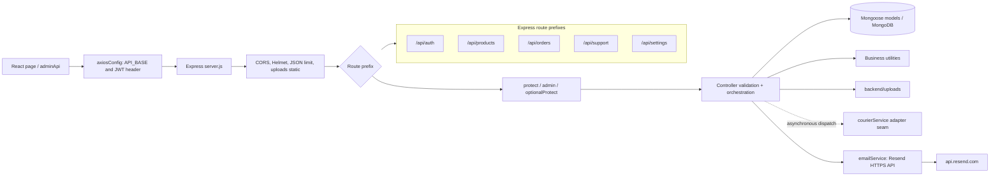

`server.js` validates required environment, installs common middleware and
mounts the five route modules. Route modules select middleware; controllers
call models and utilities. The mail provider is called only for the admin
customer-reset request when Resend settings are configured.

## 20. API authorization and route map

| Route family | Representative operations | Access enforced by route middleware |
|---|---|---|
| `/api/auth` | shopper/admin login, register, profile, session, own password, admin reset-email, public reset request/completion | `/login` rejects admins; `/admin/login` rejects non-admins and allows five failed attempts per observed IP per 15 minutes; own password requires `protect`; admin reset email requires `protect` + `admin` |
| `/api/products` | catalog/categories/detail, create/update/delete | Public reads use optional admin identity for hidden items; mutations require admin |
| `/api/orders` | guest/account place, own list/detail, all orders, analytics, manual cash, status | Guest/account checkout is rate-limited and validates guest contact when no JWT is present; history requires user; admin operations require admin; detail enforces owner/admin in controller |
| `/api/support` | user/guest create, own list, admin list/status/reply | User routes use `protect`; guest creation is public; administration requires user + admin |
| `/api/settings` | public COD settings, private settings read/update | public checkout read is unauthenticated; private settings require user + admin |

## 21. Admin customer password-reset sequence

```mermaid
sequenceDiagram
        actor Admin
        actor Customer
        participant AdminUI as AdminPage / Settings
        participant API as Express auth routes
        participant Guard as protect + admin
        participant Auth as authController
        participant User as User document
        participant Mail as emailService
        participant Resend as Resend API
        participant ResetUI as PasswordResetPage
        participant PublicReset as ForgotPasswordPage

        Admin->>AdminUI: Enter customer email
        AdminUI->>API: PUT /api/auth/admin/customer-password (admin JWT)
        API->>Guard: Verify JWT and isAdmin
        Guard->>Auth: Allow reset request
        Auth->>User: Find non-admin account
        Auth->>Auth: Generate random token, store its SHA-256 hash, set 20-minute expiry
        Auth->>Mail: Send reset URL to customer's registered email
        Mail->>Resend: POST email request (server-side API key)
        Resend-->>Customer: Email with one-time reset link
        Auth-->>AdminUI: Sent confirmation, or delivery error
        Customer->>PublicReset: Enter account email
        PublicReset->>API: POST /api/auth/password/reset/request
        API->>Auth: Apply public per-IP rate limit
        Auth->>User: Find eligible non-admin account
        alt Eligible customer and email accepted
            Auth->>Auth: Store token hash and 20-minute expiry
            Auth->>Mail: Send one-time reset URL
            Mail->>Resend: POST email request
        else Unknown/admin account or email failure
            Auth->>Auth: Do not reveal account or delivery state
        end
        Auth-->>PublicReset: Generic accepted confirmation
        Customer->>ResetUI: Open /reset-password/:token
        Customer->>ResetUI: Enter and confirm new password
        ResetUI->>API: POST /api/auth/password/reset with token and new password
        API->>Auth: Rate-limit and validate request
        Auth->>User: Hash submitted token and find matching unexpired hash
        Auth->>User: Atomically claim token, then save bcrypt password hash
        Auth-->>ResetUI: Success; token can no longer be reused
```

If email delivery fails, the stored reset token is cleared and the admin gets
a `503` response. The raw token exists only in the generated link/email and
request; MongoDB stores only its hash and expiry. Reset completion is
single-use and requires a 12-character minimum. No plaintext password is
emailed.

## 22. Password-reset token state model

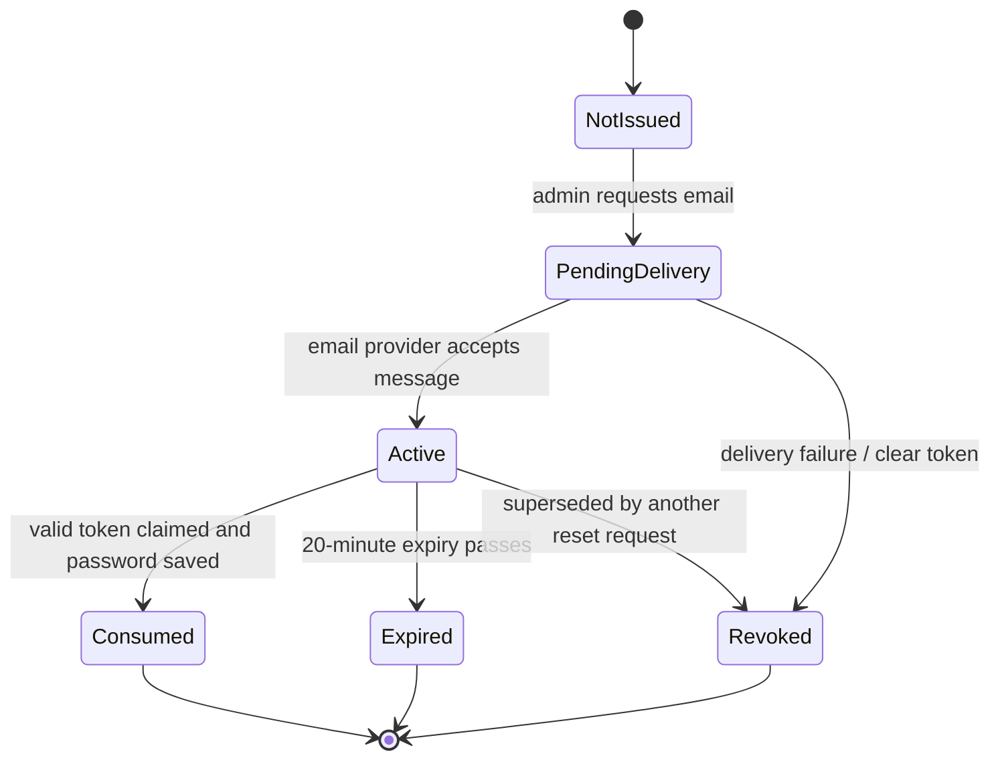

## 23. User, order and browser-state class relationships

This focused class view clarifies which values are documents, embedded
subdocuments, references, or browser-local state.

```mermaid
classDiagram
        class User {
            +ObjectId _id
            +String email
            +String password
            +Boolean isAdmin
            +String passwordResetTokenHash
            +Date passwordResetExpiresAt
        }
        class Product {
            +ObjectId _id
            +String name
            +String category
            +Number pricePKR
            +Number priceUSD
            +Number stock
            +Number weightKg
            +String[] images
            +String[] colors
            +String[] sizes
            +Boolean isLocal
            +Boolean isVisible
        }
        class Order {
            +ObjectId user
            +OrderItem[] products
            +Number productTotal
            +Number shippingFee
            +Number codFee
            +Number totalPrice
            +String shippingZone
            +String status
            +String paymentStatus
            +String courierDispatchStatus
        }
        class OrderItem {
            +ObjectId product
            +String name
            +String image
            +String selectedColor
            +String selectedSize
            +Number price
            +Number originalPrice
            +Number discountPercent
            +Number quantity
            +Number weightKg
        }
        class SupportTicket {
            +ObjectId user
            +String name
            +String email
            +String subject
            +String message
            +String orderId
            +String status
            +String adminReply
            +Date resolvedAt
        }
        class SystemSettings {
            +String key
            +Boolean internationalEnabled
            +Boolean codEnabled
            +String codFeeMode
            +Number codFee
            +Number codThreshold
            +String courierProvider
            +String courierApiKey
        }
        class BrowserStorage {
            +CartLine[] cart
            +Product[] recentlyViewed
            +String marketMode
            +String themePreference
            +Number exchangeRate
        }
        class CartLine {
            +Product productSnapshot
            +Number quantity
            +String selectedColor
            +String selectedSize
        }

        User "0..1" --> "0..*" Order : account owns; guest has null user
        Order "1" *-- "1..*" OrderItem : embeds
        OrderItem "0..*" --> "0..1" Product : source reference
        User "0..1" --> "0..*" SupportTicket : submits
        BrowserStorage "1" *-- "0..*" CartLine : localStorage
        CartLine "0..*" --> "1" Product : identifies item
```

`User.password` is a bcrypt hash. The password-reset fields are hidden from
normal queries; `SystemSettings.courierApiKey` is also `select: false` and is
encrypted at rest when the settings encryption key is configured.
`OrderItem` is embedded in an Order; `OrderItem.product` can be null for manual
cash lines. A guest SupportTicket has `user: null`. BrowserStorage and CartLine
are conceptual client-side data, not MongoDB models. SystemSettings is read at
checkout but is not directly persisted as an Order relationship.

## 24. Module inventory and count

| Package | Files / responsibilities |
|---|---|
| `frontend/src` (44 matched source/style files) | App/router, customer and admin pages, shared components, contexts, utilities, styles, and tests |
| `backend` (64 matched JS/JSON/Markdown files) | Express API, config, 9 route modules, controllers, 7 models, middleware, services, utilities, scripts, tests, and package manifests |
| `docs` | Requirements, API, architecture/UML, QA, user guides, deployment, release and policy documents |

The counts use the extension/path scopes in the repository inventory above;
they are not LOC counts or a list of every repository file. Generated Android
build outputs, frontend `dist`, backend `node_modules`, backups, uploads, and
binary assets are excluded. Together the current patterns match 108 files
(64 backend and 44 frontend).

## 25. GitHub documentation map

- Start at [`README.md`](../README.md), then use [`DOCUMENTATION_INDEX.md`](./DOCUMENTATION_INDEX.md).
- [`TECHNICAL_GUIDE.md`](./TECHNICAL_GUIDE.md) summarizes the source/package map.
- This file contains implementation-based Mermaid/UML views.
- [`ARCHITECTURE.md`](./ARCHITECTURE.md) gives deployment and system overview.
- [`API_REFERENCE.md`](./API_REFERENCE.md) is the endpoint/auth source of truth.
- [`FEATURE_COVERAGE.md`](./FEATURE_COVERAGE.md) distinguishes implemented, partial and missing behavior.

All diagrams intentionally use Mermaid syntax supported by GitHub Markdown.
For exact UML model interchange, use a UML editor and export XMI/PlantUML; the
Mermaid views are readable, reviewable source documentation rather than XMI.

## 26. Shopper/admin login security sequence

```mermaid
sequenceDiagram
    actor Shopper
    actor Admin
    participant ShopUI as Shopper login
    participant AdminUI as Admin login
    participant API as Auth routes
    participant Limiter as Admin IP limiter
    participant Auth as authController
    participant DB as User collection

    Shopper->>ShopUI: Submit identifier and password
    ShopUI->>API: POST /api/auth/login
    API->>Auth: Shopper-only credential check
    Auth->>DB: Verify password and isAdmin=false
    alt shopper account
        Auth-->>ShopUI: Shopper JWT and profile
    else admin or invalid account
        Auth-->>ShopUI: Generic 401 without a token
    end

    Admin->>AdminUI: Submit credentials at /admin/login
    AdminUI->>API: POST /api/auth/admin/login
    API->>Limiter: Check failed attempts for observed IP
    alt more than five failures in 15 minutes
        Limiter-->>AdminUI: 429 throttled response
    else within limit
        API->>Auth: Admin-only credential check
        Auth->>DB: Verify password and isAdmin=true
        alt administrator account
            Auth-->>AdminUI: Admin JWT and profile
        else shopper or invalid account
            Auth-->>AdminUI: Generic 401 without a token
        end
    end
```

The limiter is in-memory and per API process today. Use a shared store for
multiple instances, configure only trusted proxies, and add MFA/passkeys before
a high-risk production launch. A distinct icon or URL is not an authorization
control; role checks on the server remain mandatory.

## 27. Registration and portal activity

```mermaid
flowchart TD
    Start((Open app)) --> Portal{Choose portal}
    Portal -->|Shopper :3000| ShopHome[Browse shopper portal]
    ShopHome --> ShopChoice{Already registered?}
    ShopChoice -->|No| Signup[Enter registration details]
    Signup --> RegisterAPI[POST /api/auth/register]
    RegisterAPI --> Valid{Details valid and unique?}
    Valid -->|No| SignupError[Show validation error]
    SignupError --> Signup
    Valid -->|Yes| CreateShopper[Create user with isAdmin=false]
    CreateShopper --> ShopperJWT[Return shopper JWT]
    ShopChoice -->|Yes| ShopperLogin[Submit email/username and password]
    ShopperLogin --> ShopperAPI[POST /api/auth/login]
    ShopperAPI --> ShopperRole{Password valid and isAdmin=false?}
    ShopperRole -->|Yes| ShopperJWT
    ShopperRole -->|No| ShopperError[Generic 401; issue no token]
    ShopperError --> ShopperLogin

    Portal -->|Admin :3001| AdminLogin[Open admin-only portal]
    AdminLogin --> AdminCreds[Submit admin credentials]
    AdminCreds --> AdminAPI[POST /api/auth/admin/login]
    AdminAPI --> Attempts{Five failed attempts in 15 minutes?}
    Attempts -->|Yes| Throttle[Return 429]
    Attempts -->|No| AdminRole{Password valid and isAdmin=true?}
    AdminRole -->|Yes| AdminJWT[Return admin JWT]
    AdminRole -->|No| AdminError[Generic 401; issue no token]
    AdminError --> AdminCreds
```

Local portal processes share the same API (`:5000`) and database; the separate
ports and icons are operational navigation, not authorization controls.
Registration always creates a shopper account; admin accounts must be
provisioned with the secure bootstrap/reset scripts.
